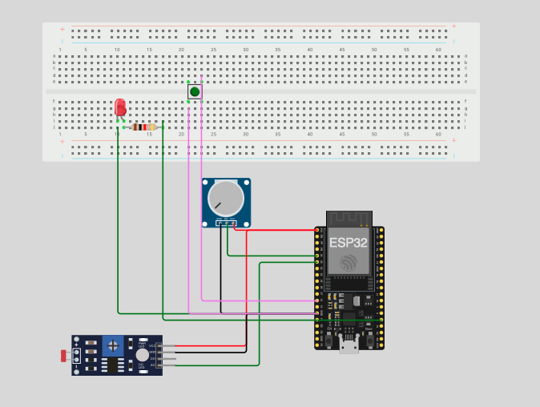
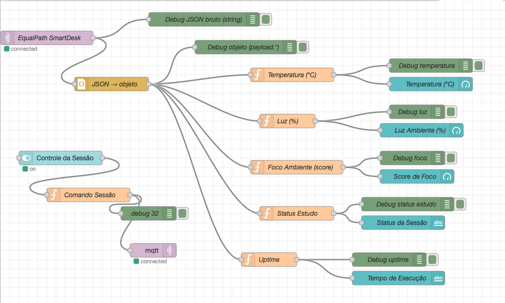
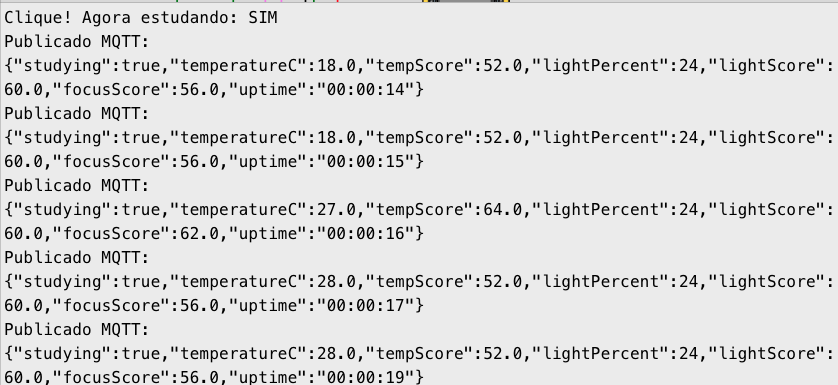

# 🌟 EqualPath SmartDesk — IoT aplicada ao Futuro do Trabalho

O **EqualPath** é uma plataforma **mobile** desenvolvida para apoiar estudantes e profissionais em processos de **transição de carreira**, combinando estratégias de **reskilling** e **upskilling**.  
A solução identifica as **competências atuais** do usuário e sugere **novos caminhos profissionais (“career paths”)** que aproveitam habilidades já existentes, conforme práticas reconhecidas pelo *World Economic Forum* e pelo *OECD Skill Framework*.

O aplicativo orienta migrações para áreas mais digitais — por exemplo, alguém com experiência em **marketing tradicional** pode receber recomendações relacionadas a **marketing digital, análise de dados, mídias pagas ou CRM**.  
Quando o usuário continua na mesma área, aprofundando competências, ocorre **upskilling**; quando usa habilidades adjacentes para **mudar de área**, caracteriza **reskilling**.

O objetivo central é **reduzir a fricção da mudança de carreira**, oferecendo rotas realistas, habilidades adjacentes, cursos recomendados e sugestões de evolução profissional baseadas em dados.

O módulo **EqualPath SmartDesk** é a parte **IoT** do projeto. Ele monitora o ambiente de estudo usando sensores, calcula um **score de foco ambiental**, exibe tudo em um dashboard Node-RED e permite iniciar/pausar sessões de estudo em tempo real.

A solução combina:

- 🧩 ESP32 + sensores físicos  
- 📡 Telemetria via MQTT  
- 🧠 Processamento Node-RED  
- 📊 Dashboard em tempo real  
- 🎯 Indicadores de foco, ambiente e sessão  

---

## 🎯 1. Objetivo da Solução

O EqualPath SmartDesk monitora:

- 🌡️ Temperatura (simulada com potenciômetro)  
- 💡 Luminosidade (via LDR)  
- 📈 Score de foco ambiental  
- ⏱️ Status e tempo da sessão  

### 📚 Referências usadas para definir limites ideais de luz e temperatura

Os valores utilizados foram baseados em **normas internacionais de ergonomia, conforto ambiental e iluminação**:

### 💡 Iluminação ideal para estudo (lux)
- **500 lux** recomendado para leitura e foco prolongado  
  **Fonte:** ISO 8995-1 / CIE — *Lighting of Workplaces*  
- Faixa aceitável: **300–750 lux**  
  **Fonte:** IESNA (Illuminating Engineering Society) — *Lighting Handbook*

📌 **Observação importante:**  
Como o sensor LDR **não mede lux real**, e sim intensidade relativa de luz,  
a faixa recomendada foi **convertida proporcionalmente** para uma zona ideal entre **40% e 70%** da leitura analógica do LDR.

### 🌡️ Temperatura ideal para estudo (°C)
- Faixa ideal: **22°C a 24°C**  
  **Fonte:** ASHRAE Standard 55 — *Thermal Environmental Conditions for Human Occupancy*  
- Valores que prejudicam o foco:  
  - **> 26°C** → aumenta fadiga e reduz produtividade  
  - **< 20°C** → desconforto térmico  
  **Fonte:** WHO — *Indoor Environment Quality Guidelines*

📌 **Observação importante:**  
Como o protótipo não tinha um sensor real de temperatura, foi utilizado um **potenciômetro** para **simular a variação térmica**. O valor do potenciômetro é convertido internamente para °C apenas para fins de validação da lógica.

Conectando IoT ao aprendizado, reforçando pilares do **Futuro do Trabalho**:

- Automação  
- Autogestão baseada em dados  
- Ambientes inteligentes  
- Produtividade sustentada por métricas

### 🏙️ Onde o SmartDesk seria usado (conceito do projeto)

O SmartDesk não é um dispositivo pessoal, mas sim um equipamento pensado para ficar disponível em **pontos públicos de estudo**, como:

- bibliotecas
- escolas técnicas
- centros comunitários
- coworkings públicos
- hubs de formação profissional

Como smartphones **não oferecem sensores ambientais externos confiáveis** (temperatura ambiente real, luminosidade do espaço, ergonomia), o SmartDesk fornece uma infraestrutura acessível que qualquer pessoa pode usar gratuitamente.

Isso reforça a missão do EqualPath: **democratizar o reskilling**, oferecendo tanto orientação digital quanto um ambiente físico otimizado para estudo, sem exigir que o usuário tenha hardware próprio.

---

## 🏗️ 2. Arquitetura da Solução

A arquitetura possui três camadas principais:

### 2.1 🎛️ Camada Física (ESP32 + Sensores)

Componentes:
- ESP32 DevKit  
- LDR (luminosidade)  
- Potenciômetro (temperatura simulada)  
- LED (feedback de foco)  
- Botão (controle de sessão)

Simulação Wokwi (link oficial):  
https://wokwi.com/projects/447929001478833153

Arquivos:
- `/diagram.json`  
- `/sketch.ino`  

---

### 2.2 ☁️ Camada de Comunicação (MQTT)

Broker:
- Host: `test.mosquitto.org`
- Port: `1883`

Tópicos:
| Finalidade | Tópico |
|-----------|--------|
| Telemetria | `equalpath/smartdesk/data` |
| Comando start/stop | `equalpath/smartdesk/cmd` |

---

### 2.3 🧩 Camada de Processamento (Node-RED)

Arquivo do flow:
- `flows-3.json`

Funções:
- Conversão do JSON recebido  
- Atualização dos gauges  
- Controle da sessão via switch  
- Debugs e logs  
- Dashboard completo  

Widgets:
- Gauge de temperatura  
- Gauge de luz  
- Gauge de foco  
- Status da sessão  
- Uptime  
- Botão start/stop  

---

## 📊 3. Dashboard EqualPath SmartDesk

Conteúdo exibido:
- 🌡️ Temperatura (°C)  
- 💡 Luminosidade (%)  
- 🎯 Score de Foco  
- 🟢 Status da Sessão  
- ⏱️ Uptime  
- 🎛️ Switch de controle da sessão  

Tudo atualizado via MQTT em tempo real.

---

## 🧪 4. Como Executar

### 4.1 ESP32 no Wokwi

**Opção A — Abrir diretamente pelo link**  
https://wokwi.com/projects/447929001478833153  

**Opção B — Manual**
1. Carregar `diagram.json` + `sketch.ino` no Wokwi  
2. Conectar ao WiFi `Wokwi-GUEST`  
3. Abrir o Serial Monitor  
4. Testar sensores e botão  

LDR → luz  
Potenciômetro → temperatura  
Botão → inicia/pausa  
LED → feedback de foco  

---

### 4.2 Node-RED

1. Abrir http://localhost:1880  
2. Importar `flows-3.json`  
3. Configurar MQTT:  
   - `test.mosquitto.org` | Porta 1883  
4. Deploy  
5. Abrir dashboard:  
   http://localhost:1880/ui

---

## 🧠 5. Funcionamento Interno do ESP32

O ESP32:
- Lê sensores a cada ~1.2s  
- Calcula `tempScore`, `lightScore`, `focusScore`  
- Envia JSON via MQTT  
- Recebe comandos via MQTT  
- Controla LED conforme foco  

Exemplo de JSON enviado:

```json
{
  "studying": true,
  "temperatureC": 24.0,
  "tempScore": 100,
  "lightPercent": 60,
  "lightScore": 100,
  "focusScore": 100,
  "uptime": "00:15:27"
}
```

---

## 📁 6. Estrutura do Repositório

```
equalpath-smartdesk/
│
├── sketch.ino         # Código do ESP32
├── diagram.json       # Circuito Wokwi
├── flows-3.json       # Fluxo Node-RED
├── libraries.txt      # Dependências
└── wokwi-project.txt  # Metadados do Wokwi
```

---

## 🎥 7. Vídeo Demonstrativo

O vídeo demonstra:

- Circuito no Wokwi  
- Dashboard funcionando  
- Controle da sessão  
- LED reagindo ao foco  
- Telemetria MQTT  
- Sessão start/stop via dashboard  

🔗 **Vídeo:**  
_coloque aqui o link do YouTube/Drive_

---

## 🖼️ 8. Evidências Visuais

### 📌 8.1 Circuito Wokwi  


### 📌 8.2 Fluxo Node-RED  


### 📌 8.3 Dashboard  


### 📌 8.4 Serial Monitor


---

## 👩‍💻 9. Integrantes

1. **Alane Rocha da Silva — RM561052**  
2. **Anna Beatriz de Araujo Bonfim — RM559561**  
3. **Maria Eduarda Araujo Penas — RM560944**  

---


